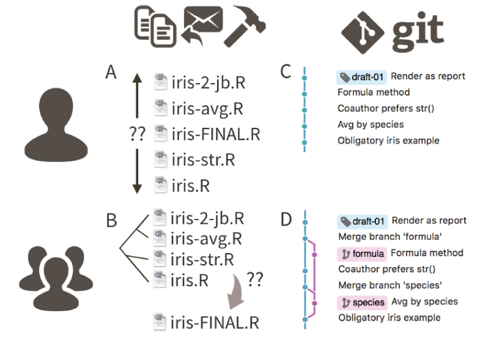

```{r setup, include=FALSE}
library(knitr)
opts_chunk$set(echo = TRUE, fig.align = "center")
```

This is a hands-on tutorial on Git and GitHub. It covers the following topics:

-   Set up
-   Basic bash commands
-   Git commands
-   GitHub operations
-   Workflow using Git and GitHub

# Set up

We will use the following software in this tutorial.

### Git

Git is the most popular version control system. It allows us to track the changes of texts as a project develops.

Git is pre-installed in Mac OS. Make sure your git version is 2.23.0 or above. You can check your git version in your terminal. First, press Command + Spacebar to open a search bar on your screen. Then, type "terminal" and double click "Terminal" in the left sidebar to open the Terminal. In it, type `git --version` to find out your git version. You can download and update git from [here](https://sourceforge.net/projects/git-osx-installer/).

In Windows, download and install Git from [here](https://git-scm.com/download/win). After the installation, press Windows key and type "git bash". You should see Git Bash in the list. Click on it to open the Git Bash terminal.

### Visual Studio Code

We will edit texts using Visual Studio Code editor. Download and install it [here](https://code.visualstudio.com/).

### GitKraken

GitKraken is a popular Git graphic user interface (GUI) which allow people to use Git without using the command line. You can download GitKraken from [here](https://www.gitkraken.com/).

### GitHub account

If you have not done so, sign up for a [GitHub](https://github.com/) account.

# Bash commands

This tutorial mainly focuses on the command line. Before learning Git, we will learn how to navigate between directories and manage files in the Bash command line. It is not the most exciting thing to learn but we will just quick go over some of the commonly used commands.

### Navigation

Open current folder in Explorer (in Windows) or in Finder (in Mac).

```{r eval=FALSE}
# Windows
start . 

# Mac
open .
```

Check the current location.

```{r eval=FALSE}
pwd # print working directory
```

List files and folders in the current location.

```{r eval=FALSE}
ls # list directory contents
ls -a
```

Go to a sub-folder.

```{r eval=FALSE}
cd sub-folder # change the working directory
```

Go to the parent folder.

```{r eval=FALSE}
cd ..
```

### Working with files and folders

Create a file.

```{r eval=FALSE}
touch file.txt
```

Create multiple files in one line.

```{r eval=FALSE}
touch file1.txt file2.txt file3.txt
```

Create a folder.

```{r eval=FALSE}
mkdir folder_name # Create directory
```

Create multiple folders in one line.

```{r eval=FALSE}
mkdir dir1 dir2 dir3
```

Delete a file.

```{r eval=FALSE}
rm file.txt # Remove the file
```

Delete a folder.

```{r eval=FALSE}
rm -rf folder_name # -rf means remove 
rmdir folder_name
```

### Exercise

1. Create a new folder and name it `bash_basics`.
2. Go into that folder
3. Create two sub-folders: `SLING` and `marvel`
4. Go into `SLING`
5. Create two files: `lab_members.txt` and `movies.txt`
6. In `lab_members.txt`, enter any three names and save the file.
7. In `movies.txt`, enter any three movies we have watched and save the file.
8. Go into `marvel` folder.
9. Create two files: `heroes.txt` and `villains.txt`
10. In each file, enter three heroes and villains respectively. Then, save the file.
11. Who cares about the villains!? Let's kill them. Delete villains file.

# Git commands

### Why Git?

People who do not use Git invariably create some form of ad-hoc version control system. Most of us may be familiar with Figure \@ref(fig:git-workflow) (A or B) which shows a hypothetical analysis using a single script file `iris.R`. Following that, the future self or collaborators creates derivative copies of `iris.R` adding file names with initials, dates, or other descriptive characters. It is not hard to imagine that the script files become too complex to manage as the project develops.  

Git tracks the changes in `iris.R` through a series of 'commits' with associated an explanatory message. Figure \@ref(fig:git-workflow) (C) shows a linear flow of time adding commits sequentially from the bottom to the top. Figure \@ref(fig:git-workflow) (D) depicts a collaboration in which contributors work independently and commit their work frequently to the main workflow. Once an important milestone is reached, the commit can be marked using a human-readable tag, as in `draft-01`.

```{r git-workflow, fig.cap="Version control using file name in (A) solo work or (B) collaborative work; Git workflow in (C) solo work or (D) collaborative work", fig.height=2.5, echo=FALSE}

```


### Configuration

It is essential to add username and email for logging purposes.

```{r eval=FALSE}
git config --global user.name "your_name"
git config --global user.email "your_email"
```

### GUI for Git

GUI provides a nice visual display of the project development and some control of Git reopsitory using point and click.

**Pros of GUI**

-   Very low barrier of entry with much better user experience compared to command line
-   Some prefer GUI, including those who can use the command line

**Cons of GUI**

-   The inner-workings of Git are hidden away with GUIs.
-   It leads to dependence on a particular piece of software.
-   Interfaces are different between various GUIs.

**Pros of the command line**

-   Git is a command line tool. All the documentation and resources online refer to the command line.
-   It becomes way more efficient once you grow comfortable with it.
-   Advanced Git features are only available in the command line.
-   The commands are the same across platforms (Windows, Mac OS, Linux).

**Cons of the command line**

-   The learning curve can be steep for beginners.

Other popular GUIs are as follow. Find out more Git GUI clients [here](https://git-scm.com/downloads/guis).

-   Github Desktop
-   SourceTree
-   Tower

This tutorial focuses on Git command line. We will use GUI to visualise the branching of the Git repository. A familiarity with Git command line helps us understand how Git works even if we eventually end up using a GUI in our work.

### Git basics

A Git repository (repo) is a work space within a folder in which changes in files and sub-folders can be tracked and managed. To use git in a data analysis project, we need to initialise a git repo in the project folder. We can have as many repos on our machines as needed.

To initialise a git repo, navigate to the project folder and use the following command. This creates a hidden `.git` folder.

```{r eval=FALSE}
git init
```

Please do not initialise a Git repo in a folder when its parent folder is also a Git repo. The latter cannot track or obtain the contents of the former.

```{r git-repo, fig.cap="Do not create a git repo within a git repo folder", echo=FALSE, out.width="40%"}

```

Before running `git init`, use `git status` to make sure the current folder is not inside a repo. You should see the following message.

```{r eval=FALSE}
git status
# fatal: not a git repository (or any of the parent directories): .git
```

If the current folder is inside a repo, `git status` shows the following message.

```{r eval=FALSE}
git status
# On branch main
# 
# No commits yet
# 
# nothing to commit (create/copy files and use "git add" to track)
```

So, `git status` is our friend!  

In this case, you can either initialise a git repo in a different folder or remove the repo in the parent folder. To remove a Git repo, simply locate and delete the associated `.git` folder.

After initialising a Git repo, you can add a 'commit' each time you want to take a snapshot of your repository. In each commit, Git can save the state of selected or all files and folders in the repo.

```{r add-a-commit, fig.cap="A flow of commits", echo=FALSE}

```

**Basic Git workflow**

1. Do work - create new files and folders, delete files, edits files, ...
2. Add changes - group specific changes together and prepare for a commit.
3. Commit - Commit the above added changes.

```{r basic-git-workflow, fig.cap="Basic git workflow", echo=FALSE}

```

`git add` adds the changes to the staging area.

```{r eval=FALSE}
# Add one or more files
git add file1.txt file2.R

# Add all changes
git add .
```

`git commit` commits all changes in the staging area.

```{r eval=FALSE}
git commit

# One liner
git commit -m "read survey data"
```

The default editor of Git command line can be overwhelming. You can set Visual Studio Code as the default editor.

```{r eval=FALSE}
git config --global core.editor "code --wait"
```

**Exercises**

1. In previous exercise, we have created `bash_basics` folder. Initiate a git repo in it.
2. Stage all files and commit. Key in "initial commit" as the commit message.
3. Add another sub-folder called `sg_hawker_food`.
4. Go into that folder.
5. Create three files with names of SG hawker dishes: `dish_name2.txt`, `dish_name2.txt`, etc.
6. Stage and commit these new files.

### More about committing

**Amending commits**

If you forgot to add files or edits after committing or you want to change the commit message, you can change the commit using `--amend` option.

```{r eval=FALSE}
git commit -m "read survey data"
git add additional_file
git commit --amend
```

**Basic guidelines**

* Commit often
* Make atomic commits: group similar changes together. Don't commit many changes all at once.
* Write meaningful but concise commit messages

An atomic commit should include a single change or fix, focusing on a single thing. For example, create a descriptive table, create a scatter plot, etc). This helps in undoing specific changes if necessary. Also, it makes the data analysis easier to review.

What is a meaning but concise commit message? The Git docs suggest present-tense imperative messages (e.g., add a table, create a plot). We can also use a different style (e.g., past-tense) that we prefer as long as it is consistent within the team.

**Ignoring files**


### Branching

### Merging

### Diffs

### Undoing stuffs

# Github operations

### Basics

### Fetch and pull

# Workflow

### Centralised workflow

### Feature branches

### Pull requests
